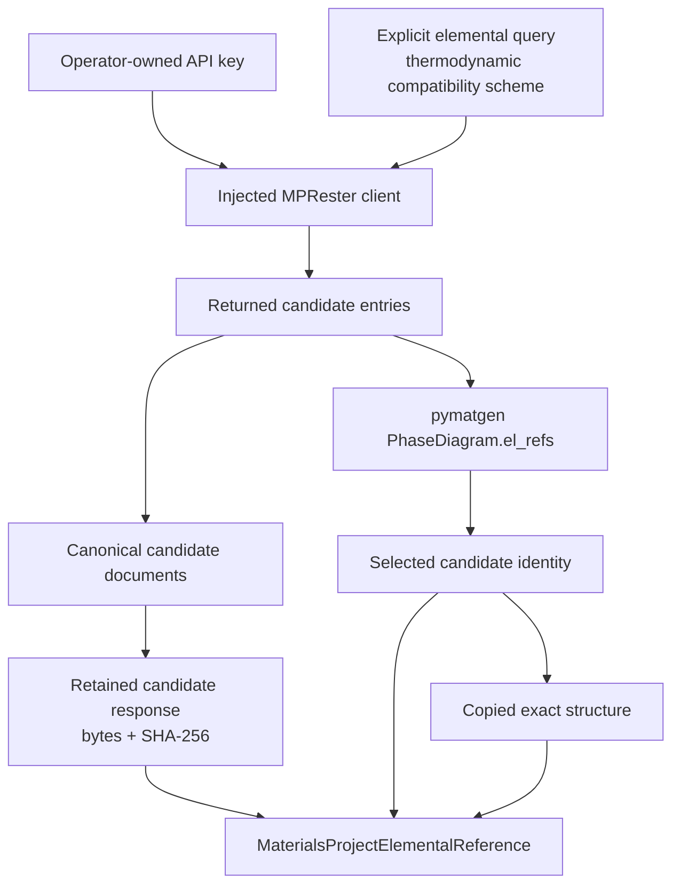
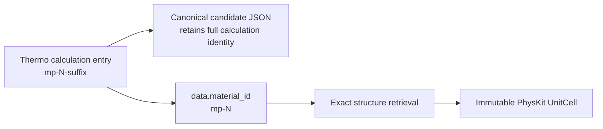
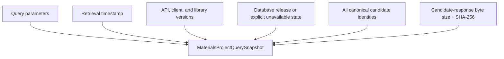
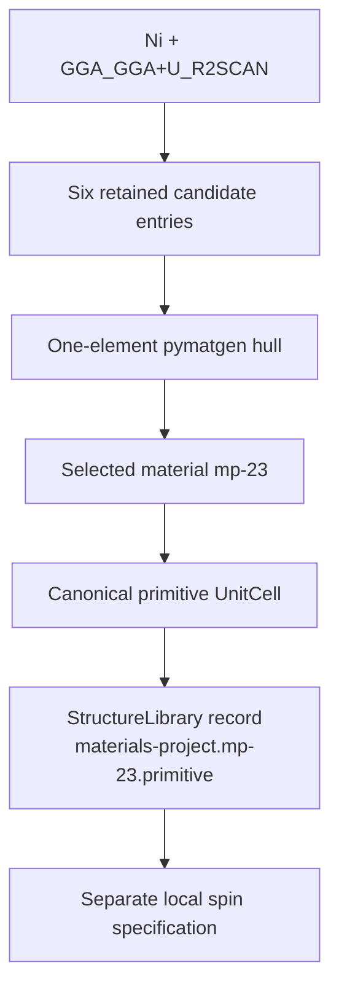
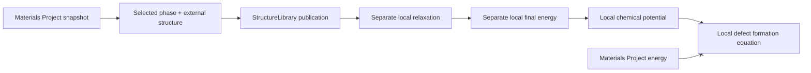
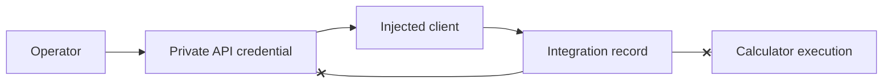

# Materials Project integration schematics

## Retrieval and selection

## Entry and structure identity

A thermodynamic calculation ID and a material ID are distinct. The full entry
remains in the candidate snapshot; only the canonical `mp-N` material identity
is sent to structure retrieval.

## Snapshot identity

The candidate-response digest identifies the retained observation, not a later
service state.

## Ni publication path

## Local-energy boundary

The crossed edge is prohibited.

## Authority and credential boundary

The operator creates and scopes the client. Synthetic tests do not contact the
service, and retained records contain no credential.
