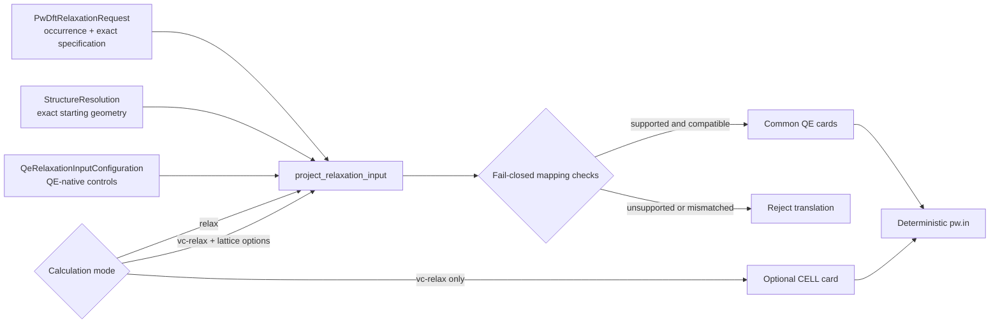
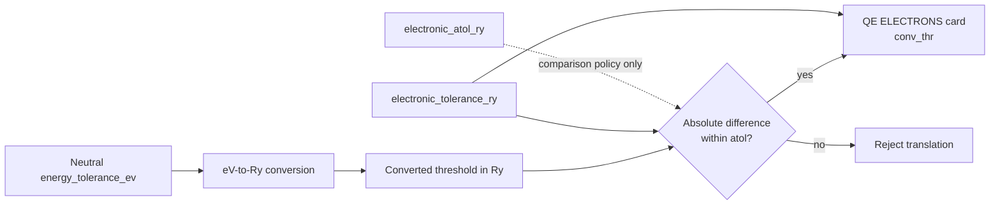
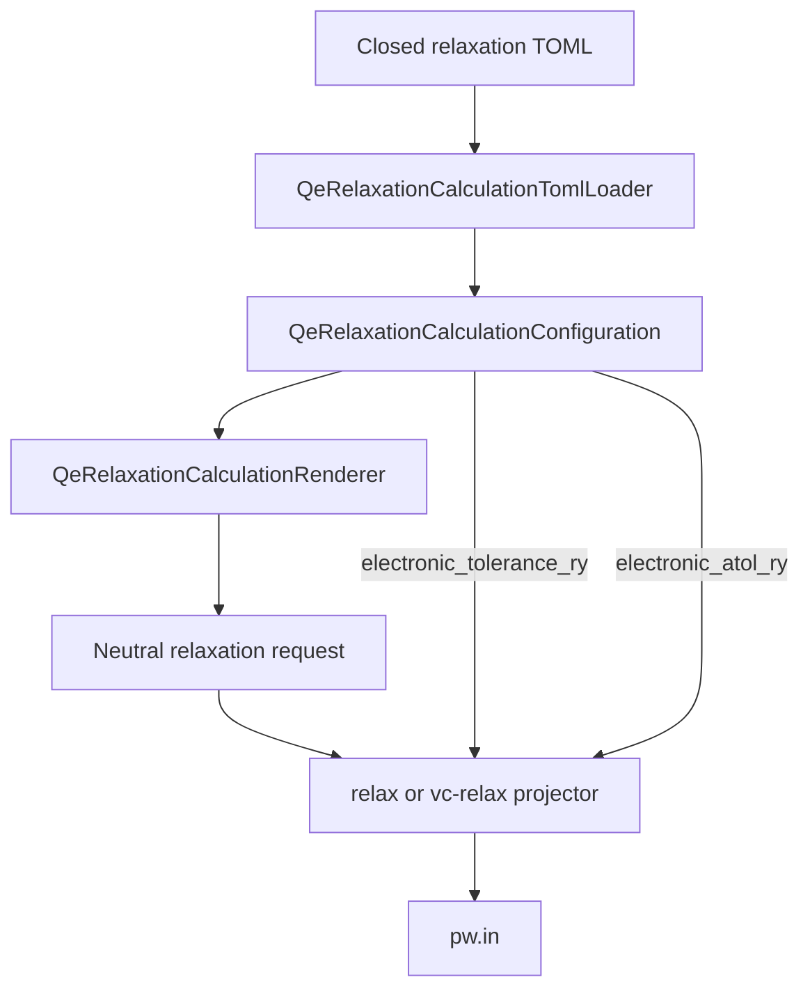
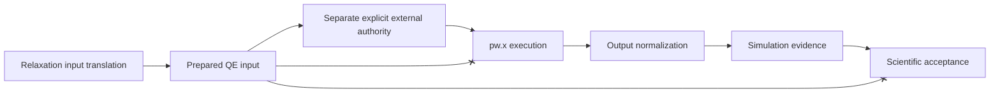

# QE relaxation calculator-input translation schematics

## Translation flow

## Electronic-threshold qualification

`electronic_atol_ry` participates only in translation qualification. It is not
rendered into the QE input.

## Retained-declaration path

## Authority and evidence boundary

