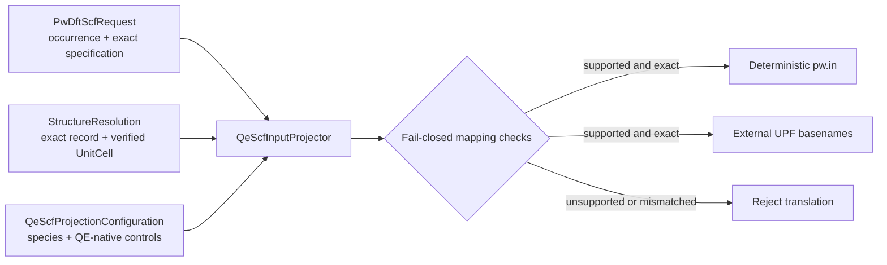
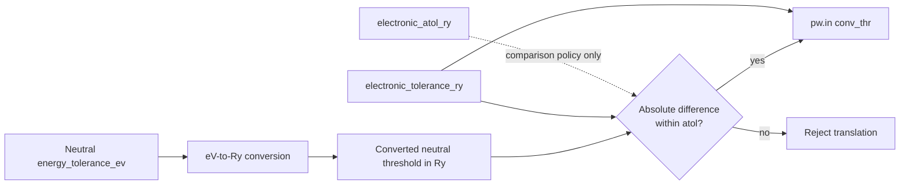
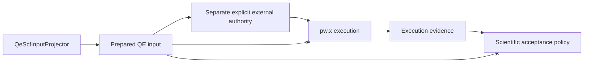

# QE SCF calculator-input translation schematics

## Translation flow

## Electronic-threshold boundary

Only `electronic_tolerance_ry` supplies the rendered `conv_thr` value.
`electronic_atol_ry` participates in qualification but has no edge to a native
calculator setting.

## Authority boundary

