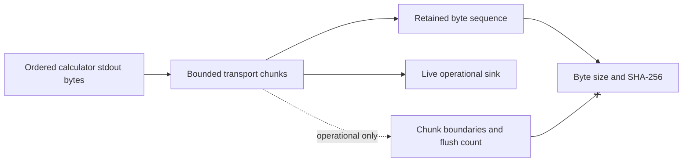

# Single-simulation execution numerical contract

## Byte preservation



The retained stdout artifact is the ordered byte sequence read from the
calculator's stdout pipe. The MVP live sink receives the same chunks in the same
stdout order. Chunk boundaries, write-call counts, terminal rendering, and
flush timing are operational details and do not participate in artifact
identity.

The retained artifact identity is computed from its final byte size and
SHA-256. The executor must not normalize newlines, replace invalid text,
transcode encodings, strip control characters, or append presentation text.
Provider parsers decide later whether and how those bytes represent text.

Stderr is retained as a separate ordered byte sequence. The executor does not
claim a total ordering between stdout and stderr unless a future process-capture
contract records such ordering explicitly.

## Stream progress and buffering

The executor emits stdout promptly after receiving each bounded chunk and
flushes the live sink so an operator can observe progress. This is best-effort
with respect to the calculator: a provider or language runtime may buffer output
before it reaches the pipe. The executor must not claim a physical timestep,
SCF-iteration boundary, or bounded progress latency from receipt timing alone.

The implementation drains stdout and stderr concurrently or directs one stream
to a nonblocking retained destination so neither pipe can deadlock the
calculator. Memory use must remain bounded independently of total output size;
the executor streams instead of accumulating complete output in memory.

## Timeout and termination

`timeout_seconds`, when present, is a positive finite duration for one process
attempt. Timeout measurement uses a monotonic elapsed-time source. On timeout,
the implementation terminates the process using a bounded escalation, drains
available pipe bytes, closes retained artifacts, writes a `timed-out` execution
record, and raises the recorded error.

Bytes received before terminal cleanup remain in their native artifacts. The
execution record does not fabricate a return code when none was observed.
Nonzero exits retain the observed integer return code; successful records
require return code zero.

Exact termination escalation and grace intervals require an implementation
contract before they become public configuration. They must not be silently
reinterpreted as scientific convergence limits.

## Concurrency cardinality

For each call:

```text
number of CalculatorExecutionRequest values = 1
maximum calculator subprocesses started     = 1
maximum terminal CalculatorExecutionRecord  = 1
```

A preflight failure starts zero subprocesses and still writes one failure
record after explicit authority has been established. A deployment-wide
concurrency limit is not represented by these cardinalities; it is a runtime
admission setting.

## Identity exclusions

The following do not alter scientific specification or calculator-input
identity:

- terminal width or color support;
- whether an operator is attached;
- live-sink chunk size;
- console flush count;
- progress-message formatting; and
- a future controller's transport destination.

They may be retained as operational telemetry under a separately versioned
runtime contract, but they are excluded from normalized scientific
observations.

## Numerical verification

Deterministic helper-process tests must compare emitted and retained byte
sequences across multiple chunk sizes, embedded non-UTF-8 bytes, missing final
newlines, large stdout/stderr volumes, nonzero exit, and timeout. These tests
verify process and byte-handling behavior only; they do not execute or validate
a scientific calculator.
