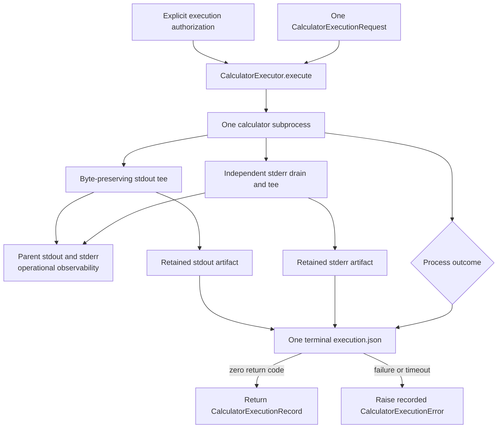
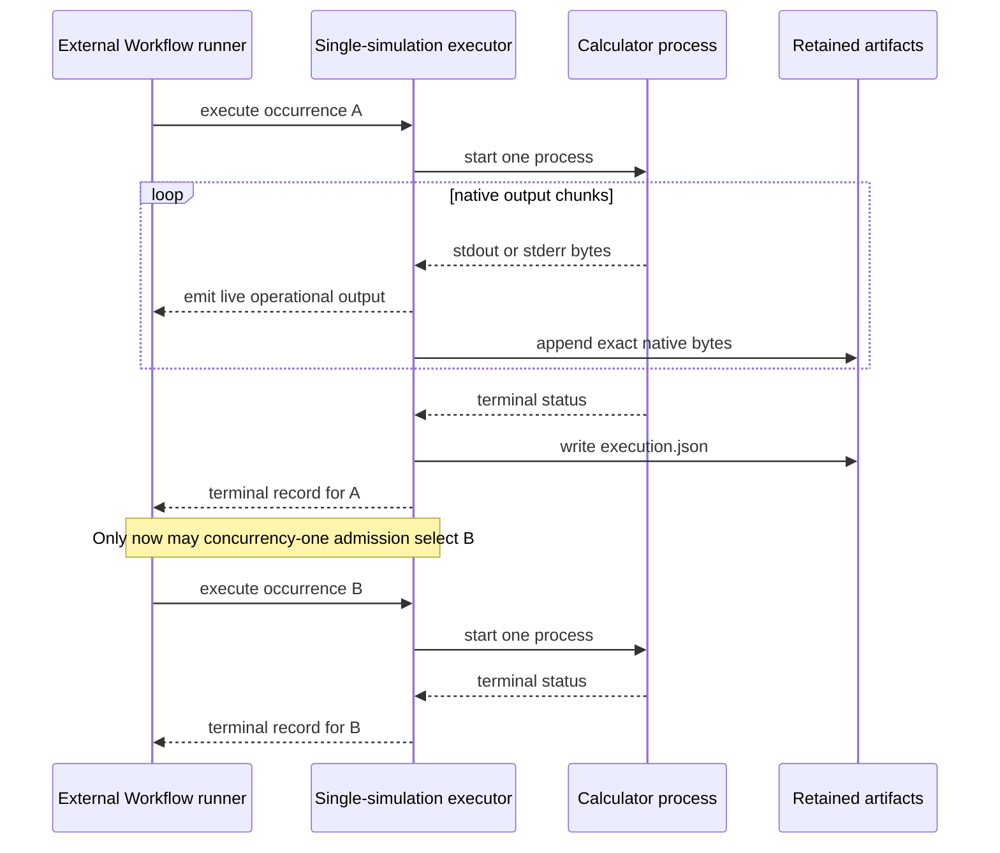
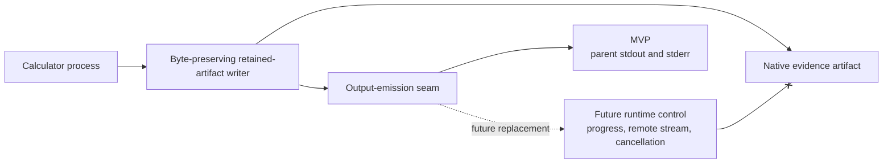
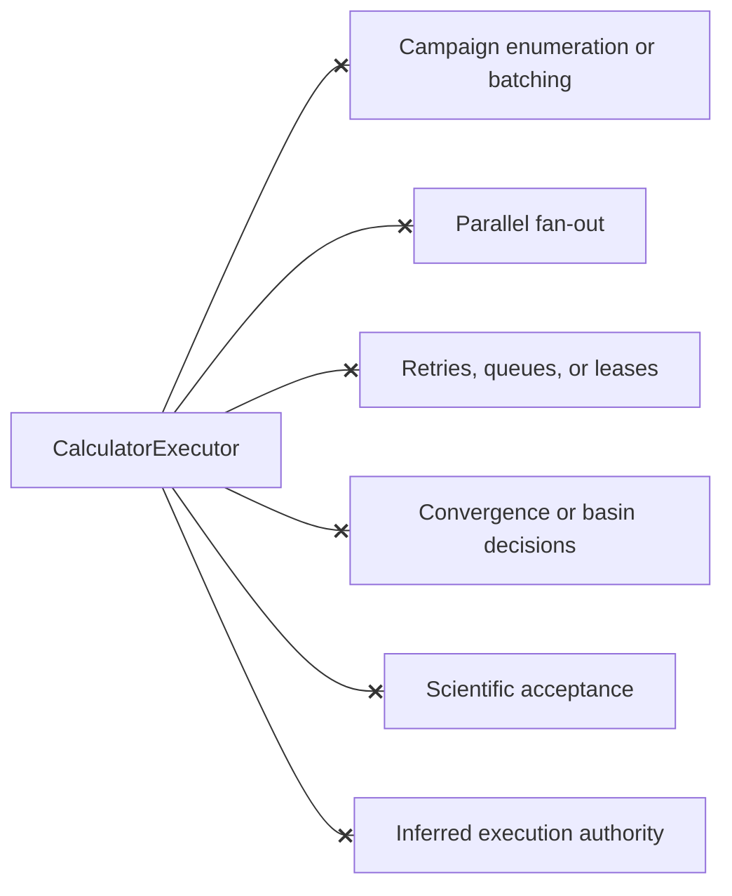

# Single-simulation calculator execution schematics

## One attempt

The live stream and retained artifact observe the same calculator bytes, but
only the retained artifact participates in evidence identity.

## Workflow sequencing at concurrency one

The executor contains none of the sequencing between occurrences. It knows only
the request currently passed to it.

## Output and future control

Replacing the operational sink must not replace, filter, reinterpret, or grant
authority to the evidence path.

## Forbidden ownership

