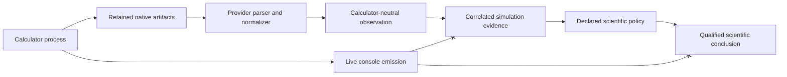

# Single-simulation execution scientific boundary

## Execution is not a scientific model

`CalculatorExecutor` performs one declared process attempt. It does not select a
Hamiltonian, exchange-correlation approximation, pseudopotential, structure,
charge state, spin state, convergence threshold, relaxation method, or
acceptance policy. Those choices must already be present in the exact scientific
specification and prepared calculator input.

Successful process termination establishes only that the calculator returned
zero under the recorded invocation. It does not establish:

- electronic convergence;
- optimizer convergence;
- force, stress, or energy convergence with numerical resolution;
- compatibility with another calculation;
- a local or global structural minimum;
- supercell-size convergence;
- agreement with experiment; or
- scientific acceptance.

Those conclusions require provider-normalized observations, exact evidence, and
separately declared scientific policies.

## Native output and evidence

The executor retains calculator-native stdout and stderr without scientific
interpretation. Live console emission is another observation of the same
runtime stream, but it is not the authoritative scientific record. Parsing and
normalization occur after execution and cite the retained artifact identities.

Output shown on a terminal cannot substitute for the retained bytes because
terminal transports may truncate, decorate, buffer, or disappear. Conversely,
retaining output does not prove that its reported calculation is scientifically
appropriate. Exact correlation to the specification, prepared input,
executable, pseudopotentials, and normalization operation remains required.

## One-at-a-time qualification

Running one simulation at a time is an operational reproducibility and resource
control choice. It reduces interleaved console output and makes operator
observation straightforward, but it does not improve the physical model or
establish numerical convergence. The same scientific occurrence should produce
the same exact evidence contract whether an external Workflow runtime admits
one or several independent calculations concurrently.

The executor guarantees one subprocess per invocation. A deployment-wide limit
of one is recorded and enforced by the external Workflow runtime, not encoded
as scientific intent.

## Failure and partial evidence

Partial native output from a failed or timed-out attempt remains evidence of
that attempt. It may support diagnosis, but it cannot be promoted to a completed
or converged observation unless a source-specific normalizer can establish the
required facts and the owning scientific contract permits that interpretation.
A retry produces a new attempt record; it does not rewrite or erase the failed
attempt.

## Separation from control

A future control channel may derive progress messages or cancellation signals
from live native output. Control observations remain operational. They cannot
modify the prepared scientific input, infer acceptance, or replace the retained
native artifacts without a separately reviewed contract.
