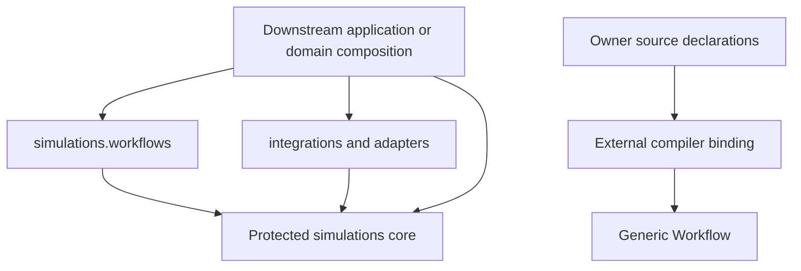
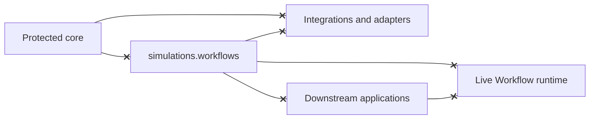
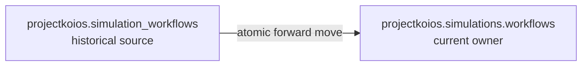
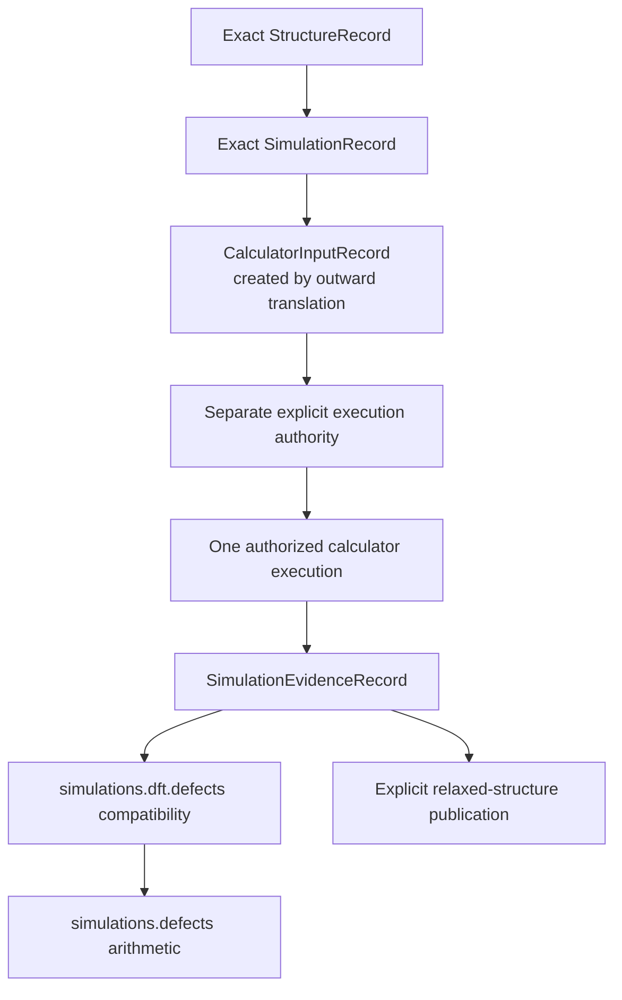
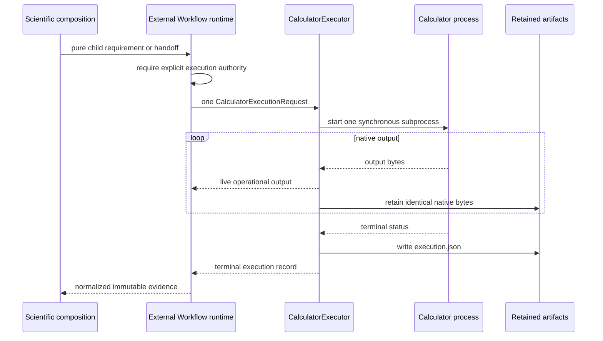

# `projectkoios.simulations` schematics

## Dependency direction

Allowed production dependencies point inward toward the protected core.
Downstream composition may use public workflow and integration contracts, but
production workflow modules do not import provider implementations and
production integration modules do not own workflow policy.

## Forbidden reverse dependencies

A live-runtime integration crosses a separately reviewed binding or process
boundary. A stable runtime-neutral source or SDK contract remains a distinct
compiler-integration decision.

## Namespace transition

The old and new production trees do not coexist. No import alias, re-export,
compatibility package, or namespace shim bridges them.

## Specification and evidence flow

Generic defect equations do not depend on the DFT binding. The binding supplies
one method-qualified evidence path.

## Authority and single-execution flow

A handoff describes required work; it does not authorize or start a calculator.
An external runtime configured with concurrency one waits for the terminal
record before admitting another occurrence. Live console output is operational
observability, not evidence, acceptance, or authority.
