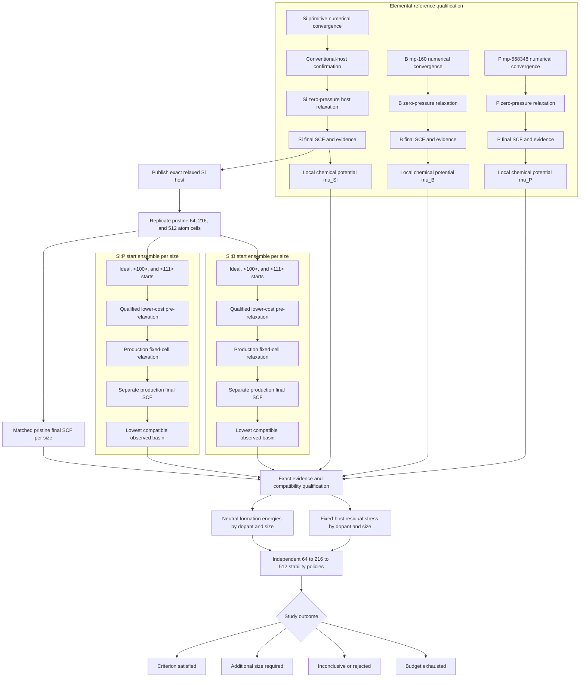
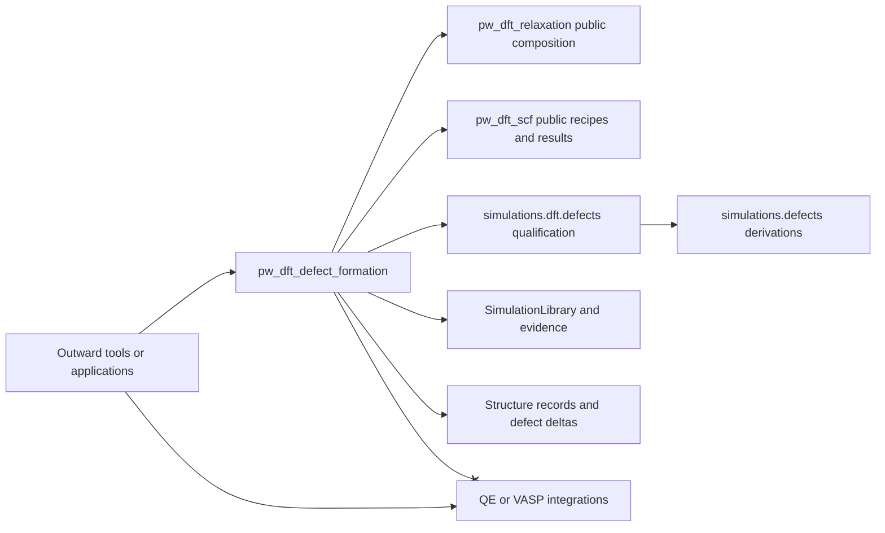
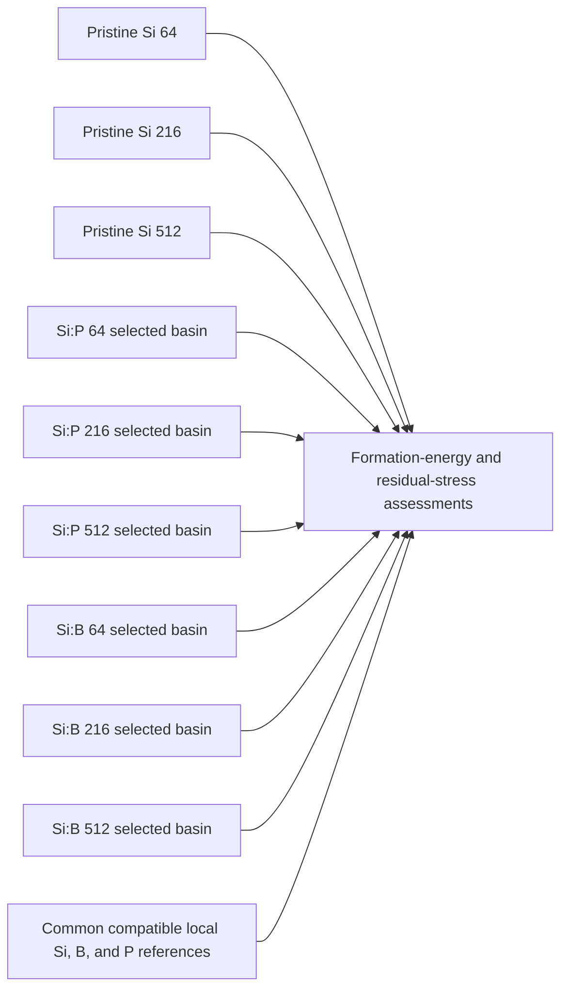
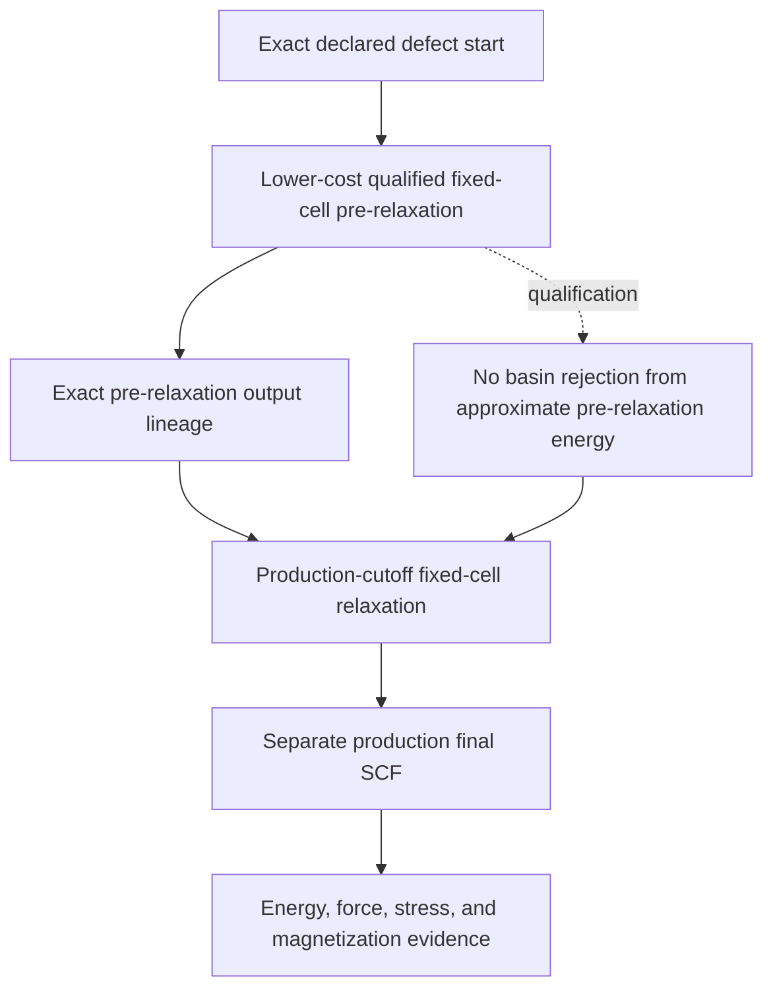
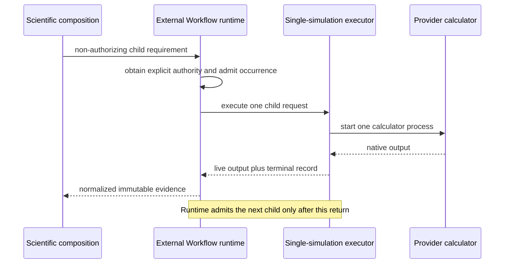
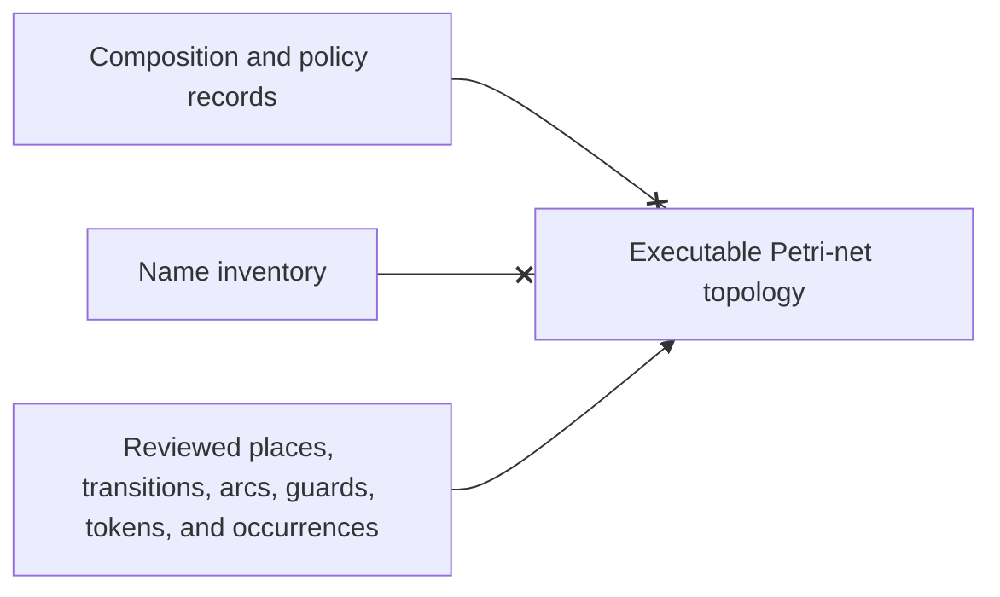

# Plane-wave DFT defect-formation workflow schematics

## End-to-end study composition

Every relaxation or SCF node is a separate one-simulation occurrence. No handoff
authorizes calculator execution.

## Reuse boundary

Outward composition binds neutral integration identifiers to provider
implementations. The production defect workflow remains provider-independent.

## Matched size series

Each defect energy is paired with the pristine cell of the same exact supercell
transformation. Optional full-cell release evidence remains a separately
labelled finite-concentration diagnostic.

## One defect-start chain

The production relaxation converges again at the final numerical settings. A
single high-cutoff energy correction on the pre-relaxed geometry is not a
production relaxation.

## Runtime boundary at concurrency one

Occurrence identity, queues, leases, retries, cancellation, authority, and
durable delivery belong to the external runtime. Scientific composition owns
which child is required and how normalized evidence is assessed.

## Future topology rule

Documentation and name inventories do not establish executable topology. If a
topology is introduced, exactly one reviewed source remains authoritative until
a separately reviewed generic Workflow extraction replaces it.
