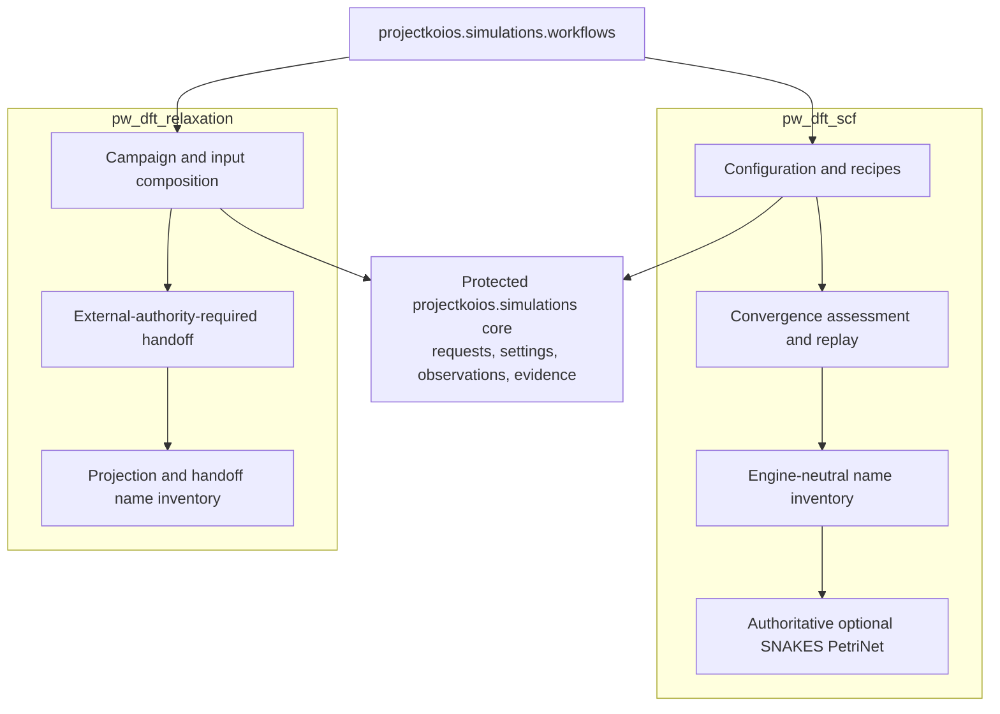
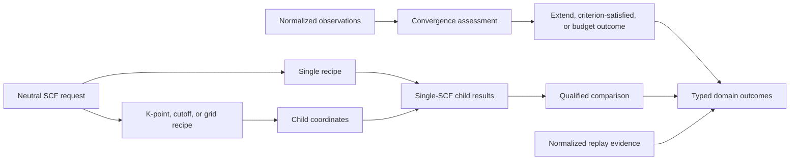
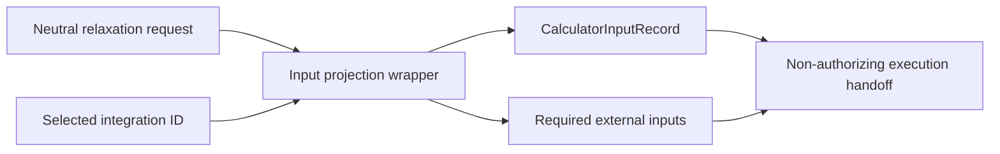
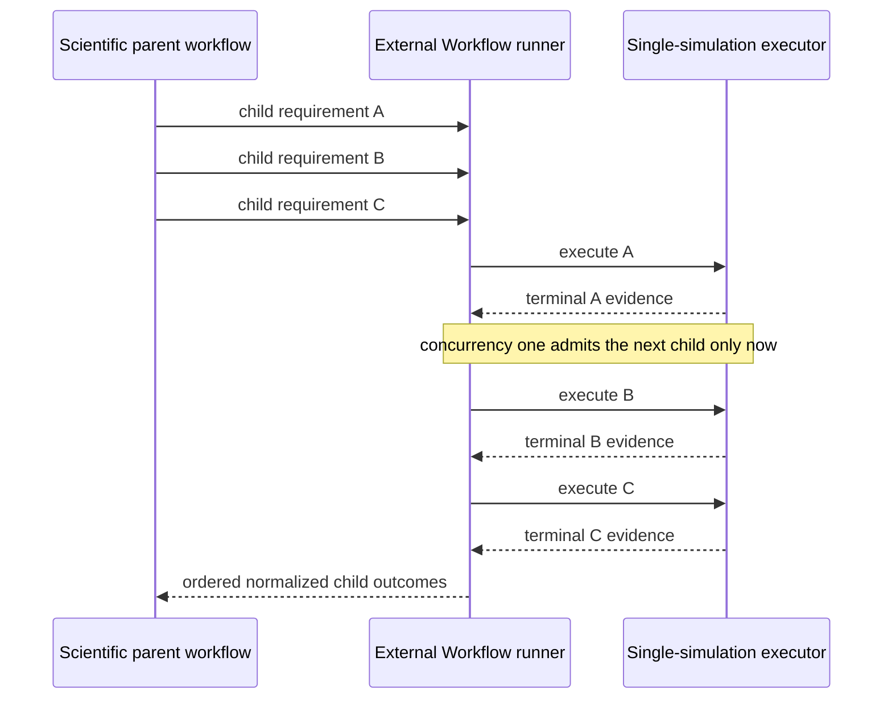
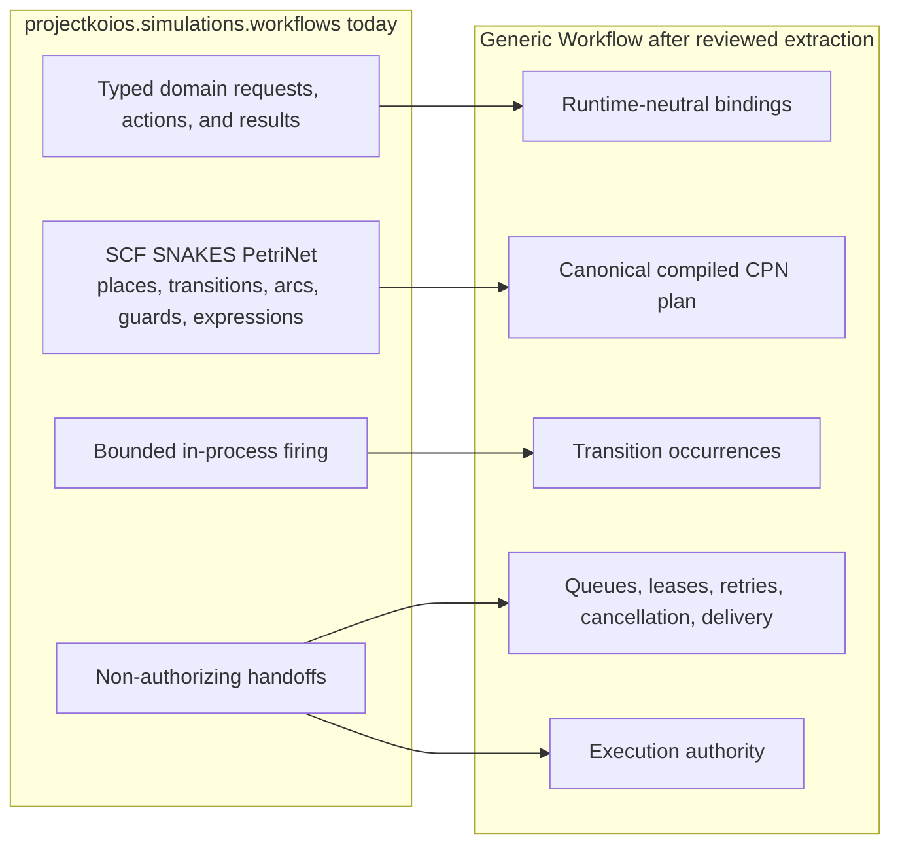
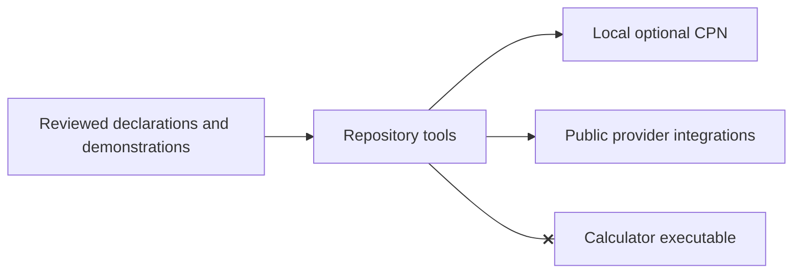

# `projectkoios.simulations.workflows` schematics

## Layer map

Allowed production dependencies point inward. The protected core never imports
the workflow composition layer.

## SCF composition flow

Comparison does not treat unlike calculator-native absolute energy zeros as an
unqualified equivalence claim. Replay consumes normalized evidence rather than
provider artifacts.

## Relaxation composition flow

The handoff states that separate explicit external authority is required. It
cannot start a calculator.

## Chained-calculation boundary

The parent may enumerate convergence coordinates, reference phases, defect
starts, or supercell sizes. It never converts those children into one batch
calculator invocation. Retry and next-child admission remain runtime concerns;
convergence and basin decisions remain scientific composition.

## Current Petri-net ownership and future extraction

The SCF `PetriNet` is authoritative today. Its definition record is a
conformance inventory, not a second topology. The local adapter is not a queue,
scheduler, or authority service.

## Tool and example boundary

Tools and examples remain outside wheel package discovery and cannot convert an
ordinary test or smoke invocation into execution authority.
